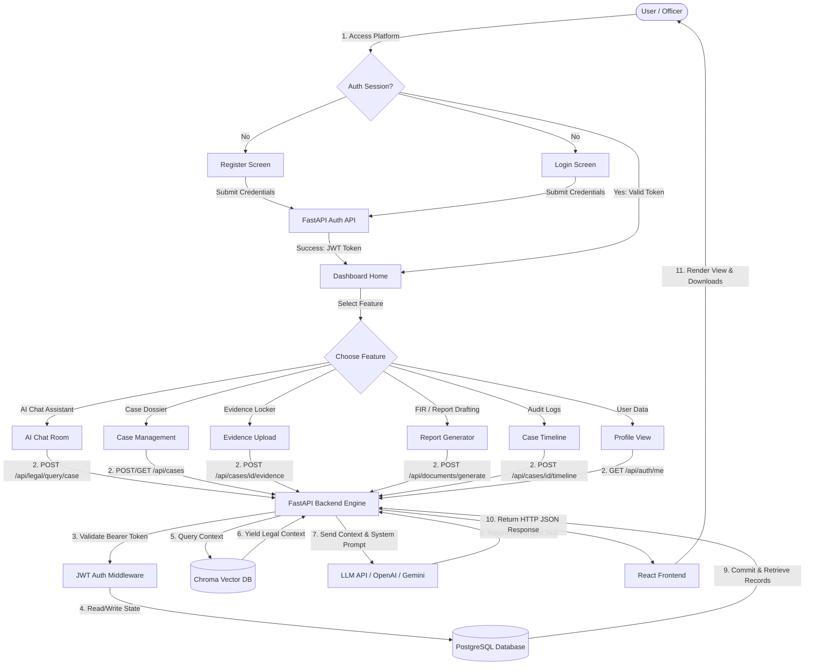
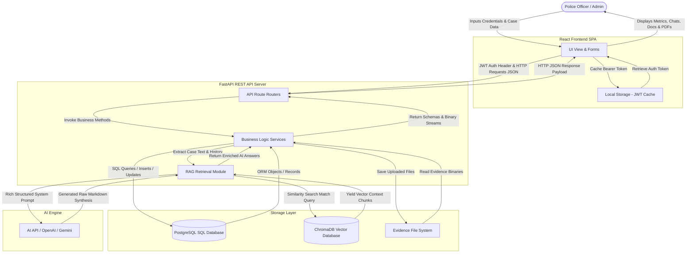
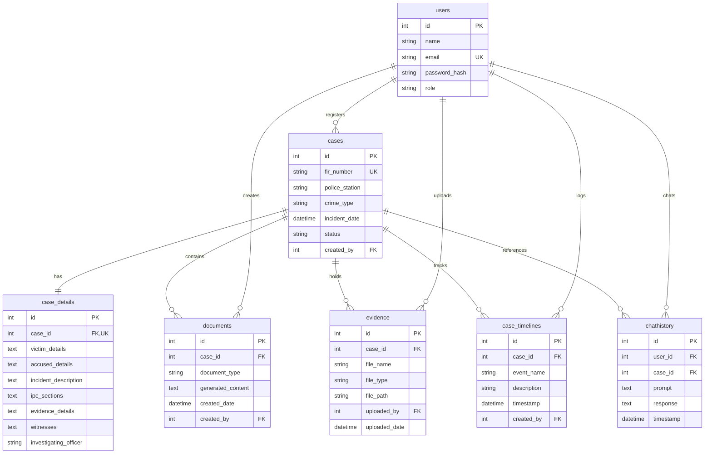
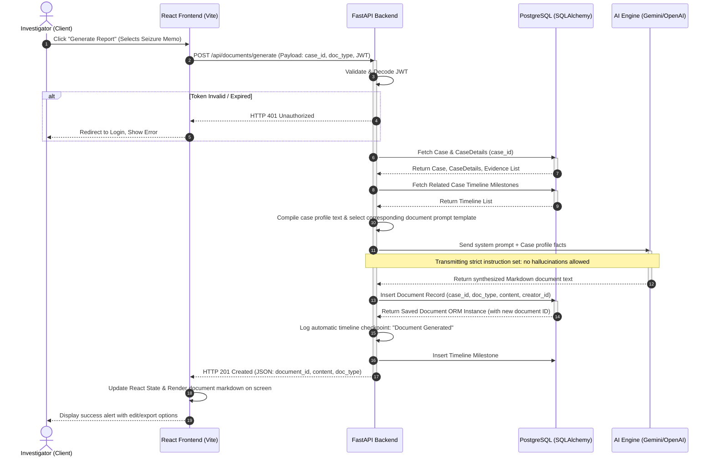

# CrimeGPT System Documentation
### AI-Powered Crime Reporting and Investigation Assistant
**Author:** Senior Software Architect & Technical Documentation Expert  
**Date:** July 15, 2026  
**Document Version:** 1.0.0  
**Target Audience:** Project Reviewers, Developers, System Administrators  

---

## Table of Contents
1. [System Overview](#1-system-overview)
2. [Workflow Diagram](#2-workflow-diagram)
3. [Data Flow Diagram (DFD)](#3-data-flow-diagram-dfd)
4. [Entity Relationship Diagram (ER Diagram)](#4-entity-relationship-diagram-er-diagram)
5. [Use Case Diagram](#5-use-case-diagram)
6. [Sequence Diagram](#6-sequence-diagram)
7. [Component Diagram](#7-component-diagram)
8. [Activity Diagram](#8-activity-diagram)
9. [Database Description](#9-database-description)
10. [API Flow & Structure](#10-api-flow--structure)
11. [Module Description](#11-module-description)
12. [Security Architecture](#12-security-architecture)
13. [Project Working Explanation](#13-project-working-explanation)

---

## 1. System Overview

### Purpose of the System
**CrimeGPT** is a state-of-the-art AI-powered crime reporting and investigation co-pilot designed to streamline police administrative workflows, enforce legally grounded document drafting, and modernize case file record keeping. 

Historically, police departments suffer from high administrative overhead due to manual paperwork, errors in legal drafting (such as in Seizure Memos, Charge Sheets, or Remand Applications), and difficulty accessing pertinent legal statutes (e.g., IPC, CrPC, BNS) during field investigations. **CrimeGPT** resolves these vulnerabilities by serving as an intelligent co-pilot. It processes case dossier records, integrates a secure physical evidence repository, maintains chronology milestones, and leverages generative AI (grounded by Retrieval-Augmented Generation (RAG) against verified legal manuals) to draft ready-to-use, legally citation-backed police documents.

### Main Modules
The platform is organized into the following core subsystems:
1. **Authentication & Access Control (RBAC):** Handles secure JWT-based login, signup, session restoration, and role validation.
2. **Case File Management (Dossier CRUD):** Orchestrates case creation, indexing, update workflows, and status tracking.
3. **AI Legal Drafting Engine (FIR & Report Generator):** Synthesizes legal drafts (such as Seizure Memos, Remand Applications, and Charge Sheets) using case context combined with generative models.
4. **Contextual Case Co-Pilot (AI Chat):** Provides a RAG-grounded chatbot utilizing case facts and indexed legal statutes.
5. **Evidence Repository (Evidence Locker):** Manages file storage, binary stream transfers, and secure association of attachments with cases.
6. **Chronological Milestone Tracker (Case Timeline):** Records sequential event logs representing the progression of an investigation.
7. **System Analytics & Telemetry (Admin Dashboard):** Provides statistical breakdowns, category analysis, and operational charts.

### User Roles
The application defines a strict Role-Based Access Control (RBAC) hierarchy:
* **Police Officer (Investigator):** Can register cases, record narratives, upload evidence, log timeline milestones, chat with the AI Case Assistant, and generate/download legal documents.
* **Administrator:** Inherits all Officer capabilities, plus exclusive access to system configuration, legal PDF uploads/indexing for RAG, and user directory management.

### Overall Architecture
The application follows a **Decoupled Client-Server (Tiered) Architecture**:
* **Presentation Layer (Frontend):** Responsive Single-Page Application (SPA) built using React.js, Vite, and Tailwind CSS.
* **Service/Application Layer (Backend):** High-performance asynchronous REST API built using Python FastAPI and Uvicorn.
* **Storage & Knowledge Layer (Database):**
  * **Relational Database:** SQLite (for local development) and Neon PostgreSQL (for production deployments), mapped via SQLAlchemy ORM.
  * **Vector Database:** ChromaDB to host vector embeddings of legal manuals.
  * **Object Store / File System:** Disks to store uploaded physical evidence attachments.
* **Artificial Intelligence Engine:** Integration with Gemini API (`gemini-2.5-flash` model for high speed and accuracy, abstractable to OpenAI API) to complete document generation and case-profile chats.

---

## 2. Workflow Diagram

The workflow diagram traces a user's operational path from the moment they navigate to the platform, authenticate, explore features, hit the API layer, and trigger database or AI operations.



### Workflow Diagram Explanation
* **User Entry & Session Identification:** The sequence starts at the top, routing the Investigator through authentication. If the JWT exists, the React client automatically uses it to populate user profiles and access the main Dashboard; otherwise, the user must Register or Login.
* **Module Selection:** Once inside the Dashboard, the User chooses a sub-feature (AI Chat, Case Dossier management, Evidence uploading, Report Generation, case Timelines, or Profile changes).
* **Network & Gateway Security:** Any selection issues a request that traverses the HTTP/HTTPS layer and passes through FastAPI's JWT authentication interceptor.
* **Storage and AI Dispatch:** Depending on whether AI is required, the request goes to the database or routes through ChromaDB to retrieve legal text, then invokes the AI Model (OpenAI/Gemini).
* **Return Response:** Finally, the generated response is sent back through the backend to the React Frontend, which renders the data or allows the user to download documents.

---

## 3. Data Flow Diagram (DFD)

This Data Flow Diagram demonstrates how data moves across boundaries between the user, frontend components, backend services, SQL/vector storage, and external AI providers.



### Data Flow Diagram Explanation
* **User Interactions:** The investigator enters case facts, uploads evidence, or prompts the AI.
* **Client Handling:** The frontend handles user events, manages authentication tokens via local storage, and communicates with the backend via Axios.
* **Server Routing:** The backend routes incoming requests, handles security, and runs business logic services.
* **Data Layer Management:** Structured database records are written to PostgreSQL via SQLAlchemy. Raw evidence files are written to the file system, and legal manuals are stored as vector embeddings in ChromaDB.
* **AI Integration:** The RAG module compiles case details, chat history, and retrieved laws into a prompt for the AI API, returning the generated text to the backend.

---

## 4. Entity Relationship Diagram (ER Diagram)

The database schema is mapped via SQLAlchemy ORM. The entities support strict relational integrity constraints, foreign keys, and cascading deletes.



### Entity Relationship Diagram Explanation
* **`users` Table:** Holds system users. It is the central authority for actions, relating to `cases` (one-to-many), `documents` (one-to-many), `evidence` (one-to-many), and `case_timelines` (one-to-many).
* **`cases` Table:** Holds basic case references like FIR number and status.
* **`case_details` Table:** Maps one-to-one with `cases`. Contains the narrative summaries, witnesses, accused profiles, and victim logs. Dividing this from the base case table optimizes lookup speeds for core telemetry metrics.
* **`documents` Table:** Houses AI-synthesized templates. Relates to a parent case and the generating officer.
* **`evidence` Table:** Manages upload metadata. Points back to the parent case and upload officer.
* **`case_timelines` Table:** Holds chronological milestones, linking case events to the officer who recorded them.
* **`chathistory` Table:** Logs AI co-pilot conversations to maintain chat history.

---

## 5. Use Case Diagram

This diagram maps system boundaries, showing how user roles (Police Officer and Administrator) interact with CrimeGPT's distinct use cases.

```mermaid
leftToRightDirection
fcg -> Actor
    Actor PoliceOfficer as "Police Officer (Investigator)"
    Actor Admin as "System Administrator"
    
    subgraph CrimeGPT_App [CrimeGPT Application Boundary]
        usecase UC_Reg as "Register Account"
        usecase UC_Log as "Login / Authenticate"
        usecase UC_Cas as "Create & Manage Cases"
        usecase UC_Evi as "Upload Evidence Files"
        usecase UC_Tim as "Log Case Timeline Milestones"
        usecase UC_Cht as "Chat with AI Case Assistant"
        usecase UC_Gen as "Generate FIR & Reports (Seizure, Remand, Charge Sheet)"
        usecase UC_Exp as "Export Document to PDF / DOCX"
        usecase UC_Upl as "Upload & Index Legal PDFs (RAG)"
        usecase UC_User as "Manage System Users"
    end
    
    %% Officer associations
    PoliceOfficer --> UC_Log
    PoliceOfficer --> UC_Cas
    PoliceOfficer --> UC_Evi
    PoliceOfficer --> UC_Tim
    PoliceOfficer --> UC_Cht
    PoliceOfficer --> UC_Gen
    PoliceOfficer --> UC_Exp
    
    %% Admin associations
    Admin --> UC_Log
    Admin --> UC_Cas
    Admin --> UC_Evi
    Admin --> UC_Tim
    Admin --> UC_Cht
    Admin --> UC_Gen
    Admin --> UC_Exp
    Admin --> UC_Upl
    Admin --> UC_User
    
    %% Inclusion relations
    UC_Reg .-> |<<includes>>| UC_Log
    UC_Gen .-> |<<includes>>| UC_Exp
```

### Use Case Diagram Explanation
* **Police Officer (Primary Actor):** Operates on case dossiers. They log timeline records, load physical attachments, prompt the AI assistant for advice on cases, and draft legal reports.
* **Administrator (Secondary Actor):** Inherits all officer privileges and has additional rights to perform system administration, manage users, and upload reference manuals to ChromaDB.
* **Application Boundary:** Explicitly encapsulates all operations within secure JWT authentication loops.

---

## 6. Sequence Diagram

This diagram visualizes a user request to generate a legal document, detailing the synchronous and asynchronous loops between the client, backend, database, and LLM.



### Sequence Diagram Explanation
* **Initiation:** The officer requests a document generation from the React UI.
* **Authentication Check:** The FastAPI backend intercepts the request and verifies the JWT signature before proceeding.
* **Information Gathering:** The server retrieves the case's database records, including details, timeline milestones, and evidence lists.
* **AI Generation:** The server formats the case data and sends a prompt to the LLM. The LLM generates the legal text.
* **Persistence:** The generated text is saved to the database. The system automatically creates a timeline milestone recording the action.
* **Delivery:** The backend returns the generated document as a JSON payload, and the React client displays it on the screen.

---

## 7. Component Diagram

The component diagram details the physical packaging, dependencies, and boundaries of modules across the stack.

```mermaid
componentDiagram
    package "User Interface (React Frontend)" {
        [React App] as Client
        [React Router] as Router
        [Axios Client] as Axios
        [Recharts UI] as Charts
    }
    
    package "Application Server (FastAPI Backend)" {
        [FastAPI Core] as Server
        [Auth Middleware] as Auth
        [Document Service] as DocService
        [RAG Coordinator] as RAGModule
    }
    
    package "Storage & File Systems" {
        database "PostgreSQL Relational DB" as SQLDB
        database "ChromaDB Vector Store" as Chroma
        folder "Uploaded Evidence Dir" as FileStore
    }
    
    package "AI Platform" {
        [LLM API Engine] as LlmEngine
    }
    
    %% Port bindings & dependencies
    Client --> Router : uses
    Client --> Charts : displays
    Client --> Axios : requests through
    
    Axios --> Server : HTTP REST / JSON / JWT
    
    Server --> Auth : validates
    Server --> DocService : delegates to
    Server --> RAGModule : coordinates search
    
    DocService --> SQLDB : SQLAlchemy ORM
    DocService --> FileStore : reads / writes binaries
    
    RAGModule --> Chroma : retrieves context
    RAGModule --> LlmEngine : dispatches prompt
    DocService --> LlmEngine : dispatches prompt
```

### Component Diagram Explanation
* **React Frontend:** Composed of React App views, React Router (which handles page transitions), Axios (handling network requests), and Recharts (providing analytical charts on case metrics).
* **FastAPI Backend:** Orchestrates routing, authenticates tokens, manages business services, and coordinates RAG retrieval.
* **Storage Tier:** Divided into a relational SQL DB for structured case metrics, a vector DB (ChromaDB) for legal reference similarity searches, and local file storage for raw evidence files.
* **AI Platform:** An external service that processes prompts from the backend and returns generated text.

---

## 8. Activity Diagram

This diagram maps the step-by-step logic of querying the AI Case Assistant, focusing on data validation, database logging, and error handling.

```mermaid
activityDiagram
    start
    :User enters chat panel and selects a Case;
    :User types prompt and clicks Send;
    :Frontend grabs cached JWT and case ID;
    :Frontend dispatches POST to /query/case;
    
    if (Is JWT Token valid?) then (Yes)
        :Backend decodes JWT & fetches User model;
        :Fetch Case record and CaseDetails from DB;
        if (Case exists?) then (Yes)
            :Compile case profile;
            :Query ChromaDB for relevant laws;
            :Build history trail from recent messages;
            :Construct system prompt;
            :Invoke LLM API;
            if (LLM responds successfully?) then (Yes)
                :Return JSON payload;
                :Render response in chat bubble;
            else (No)
                :Raise HTTP 500 Internal Error;
                :Show fallback warning message;
            endif
        else (No)
            :Raise HTTP 404 Not Found;
            :Show "Case not found" banner;
        endif
    else (No)
        :Reject with HTTP 401 Unauthorized;
        :Clear JWT cache & redirect to Login;
    endif
    stop
```

### Activity Diagram Explanation
* **Entry:** The user requests case details or enters a prompt.
* **Authentication Validation:** The server checks the request's JWT token. If the token is invalid or expired, the user's session is terminated.
* **Data Processing:** If authenticated, the server fetches the case's database record. If the case doesn't exist, it returns an error. If it does, the server compiles the case profile, fetches relevant laws from ChromaDB, constructs the prompt, and queries the AI.
* **Response Delivery:** The server returns the generated response to the frontend, which displays it to the user.

---

## 9. Database Description

CrimeGPT uses SQLAlchemy to enforce schemas and relations. The tables are designed for high query performance and data integrity.

### 1. `users` Table
* **Purpose:** Stores user profiles, credentials, and role information.
* **Fields:**
  * `id` (Integer, Primary Key, Indexed): Unique identifier.
  * `name` (String, Nullable=False): The user's full name.
  * `email` (String, Unique, Indexed, Nullable=False): The user's email address (used for login).
  * `password_hash` (String, Nullable=False): A secure Bcrypt hash of the user's password.
  * `role` (String, Default="investigator", Nullable=False): The user's system role (e.g. `ADMIN` or `POLICE_OFFICER`).
* **Relationships:**
  * One-to-many relationship with `cases` (via `created_by`).
  * One-to-many relationship with `documents` (via `created_by`).
  * One-to-many relationship with `evidence` (via `uploaded_by`).
  * One-to-many relationship with `case_timelines` (via `created_by`).

### 2. `cases` Table
* **Purpose:** Stores core case index records.
* **Fields:**
  * `id` (Integer, Primary Key, Indexed): Unique identifier.
  * `fir_number` (String, Unique, Indexed, Nullable=False): The official FIR number.
  * `police_station` (String, Nullable=False): The police station handling the case.
  * `crime_type` (String, Nullable=False): The category of the crime (e.g. Theft, Assault, Cybercrime).
  * `incident_date` (DateTime, Nullable=False): The date and time the incident occurred.
  * `status` (String, Default="active", Nullable=False): The status of the case (e.g. `active`, `closed`).
  * `created_by` (Integer, ForeignKey("users.id"), Nullable=False): The ID of the officer who registered the case.
* **Relationships:**
  * Relates to `users` (via `created_by`).
  * One-to-one relationship with `case_details` (cascade delete).
  * One-to-many relationship with `documents` (cascade delete).
  * One-to-many relationship with `evidence` (cascade delete).
  * One-to-many relationship with `case_timelines` (ordered chronologically, cascade delete).

### 3. `case_details` Table
* **Purpose:** Stores detailed case narratives and legal classifications.
* **Fields:**
  * `id` (Integer, Primary Key, Indexed): Unique identifier.
  * `case_id` (Integer, ForeignKey("cases.id", ondelete="CASCADE"), Unique, Nullable=False): The ID of the associated case.
  * `victim_details` (Text, Nullable=True): Information about the victim(s).
  * `accused_details` (Text, Nullable=True): Information about the suspect(s)/accused.
  * `incident_description` (Text, Nullable=True): A narrative description of the incident.
  * `ipc_sections` (Text, Nullable=True): The applicable penal code sections.
  * `evidence_details` (Text, Nullable=True): Descriptive details of collected evidence.
  * `witnesses` (Text, Nullable=True): Information about witnesses and statements.
  * `investigating_officer` (String, Nullable=True): The name of the lead investigating officer.
* **Relationships:**
  * Relates to `cases` (one-to-one mapping via `case_id`).

### 4. `documents` Table (AI Generated Reports)
* **Purpose:** Stores AI-generated document drafts.
* **Fields:**
  * `id` (Integer, Primary Key, Indexed): Unique identifier.
  * `case_id` (Integer, ForeignKey("cases.id", ondelete="CASCADE"), Nullable=False): The ID of the associated case.
  * `document_type` (String, Nullable=False): The type of document (e.g., `FIR summary`, `Seizure Memo`, `Remand Application`, `Charge Sheet`).
  * `generated_content` (Text, Nullable=False): The AI-generated markdown text.
  * `created_date` (DateTime, Server Default=func.now(), Nullable=False): The date and time the document was generated.
  * `created_by` (Integer, ForeignKey("users.id"), Nullable=True): The ID of the user who generated the document.
* **Relationships:**
  * Relates to `cases` (via `case_id`).
  * Relates to `users` (via `created_by`).

### 5. `evidence` Table
* **Purpose:** Stores metadata for uploaded physical evidence.
* **Fields:**
  * `id` (Integer, Primary Key, Indexed): Unique identifier.
  * `case_id` (Integer, ForeignKey("cases.id", ondelete="CASCADE"), Nullable=False): The ID of the associated case.
  * `file_name` (String, Nullable=False): The original name of the uploaded file.
  * `file_type` (String, Nullable=False): The MIME type of the file (e.g. `image/png`, `application/pdf`).
  * `file_path` (String, Nullable=False): The storage path of the file on disk.
  * `uploaded_by` (Integer, ForeignKey("users.id"), Nullable=False): The ID of the user who uploaded the file.
  * `uploaded_date` (DateTime, Default=datetime.utcnow): The date and time the file was uploaded.
* **Relationships:**
  * Relates to `cases` (via `case_id`).
  * Relates to `users` (via `uploaded_by`).

### 6. `case_timelines` Table
* **Purpose:** Stores chronological milestones for cases.
* **Fields:**
  * `id` (Integer, Primary Key, Indexed): Unique identifier.
  * `case_id` (Integer, ForeignKey("cases.id", ondelete="CASCADE"), Nullable=False): The ID of the associated case.
  * `event_name` (String, Nullable=False): The name of the event (e.g., `Arrest Made`, `FIR Registered`, `Evidence Found`).
  * `description` (String, Nullable=False): A detailed description of the event.
  * `timestamp` (DateTime, Default=datetime.utcnow, Nullable=False): The date and time the event occurred.
  * `created_by` (Integer, ForeignKey("users.id"), Nullable=False): The ID of the user who logged the event.
* **Relationships:**
  * Relates to `cases` (via `case_id`).
  * Relates to `users` (via `created_by`).

### 7. `chathistory` Table
* **Purpose:** Logs conversational queries and assistant replies per case for session memory restoration.
* **Fields:**
  * `id` (Integer, Primary Key, Indexed): Unique identifier.
  * `user_id` (Integer, ForeignKey("users.id"), Nullable=False): Authoring investigator.
  * `case_id` (Integer, ForeignKey("cases.id", ondelete="CASCADE"), Nullable=False): The associated case.
  * `prompt` (Text, Nullable=False): The user's input query.
  * `response` (Text, Nullable=False): The AI response.
  * `timestamp` (DateTime, Default=datetime.utcnow): The date and time of the conversation.
* **Relationships:**
  * Relates to `users` (via `user_id`).
  * Relates to `cases` (via `case_id`).

---

## 10. API Flow & Structure

The communication architecture uses a secure REST API pattern, with JWT tokens protecting all endpoints except public registration and login routes.

```
+------------------+                    +---------------------+                    +----------------------+
|  React Frontend  | --[JWT Token]-->   | FastAPI Auth Router | --[Checks Role]--> | FastAPI Route Target |
+------------------+                    +---------------------+                    +----------------------+
                                                                                               |
                                                                                               v
+------------------+                    +---------------------+                    +----------------------+
| Return JSON/File | <---[Returns Data] |  SQL/Chroma Database| <---[ORM Query]--- |    Business Logic    |
+------------------+                    +---------------------+                    +----------------------+
```

### API Flow Explanation
1. **Request Interception:** The react client attaches a JWT bearer token to the request header: `Authorization: Bearer <JWT>`.
2. **Gateway Verification:** The FastAPI auth router decodes the token, validating its signature and expiration claims.
3. **Role Checks:** Custom middleware verifies that the user's role has permission to access the requested route.
4. **Execution:** The business logic executes, querying the SQL or Chroma databases as needed and returning a JSON payload or binary stream to the frontend.

---

## 11. Module Description

This section details the inputs, outputs, technologies, and purpose of each core system module.

### 1. Authentication & Security
* **Purpose:** Handles user registration, authentication, and session validation.
* **Inputs:** Credentials (email, password), user roles, and registration metadata.
* **Outputs:** Secure database records, JWT access tokens, and authenticated user objects.
* **Technologies:** FastAPI Security (`HTTPBearer`), PyJWT, Bcrypt (for password hashing), and SQLAlchemy.

### 2. Dashboard
* **Purpose:** Provides system analytics, case statistics, and telemetry charts.
* **Inputs:** Analytical queries from the user interface.
* **Outputs:** Case status counts, crime category breakdowns, and document generation statistics.
* **Technologies:** React, Tailwind CSS, Recharts, and Axios.

### 3. AI Chat (Case Assistant)
* **Purpose:** Provides a conversational assistant preloaded with case details and legal context.
* **Inputs:** User prompts, case IDs, and conversation history.
* **Outputs:** AI responses containing grounded information.
* **Technologies:** ChromaDB (for vector search), FastAPI, and Google Gemini API (adaptable to OpenAI).

### 4. FIR Generator & Document Engine
* **Purpose:** Drafts legal documents based on case data.
* **Inputs:** Document types and case details.
* **Outputs:** Generated markdown documents saved to the database.
* **Technologies:** FastAPI, SQLAlchemy, Jinja2 templates, and the LLM API.

### 5. Case Management
* **Purpose:** Handles CRUD operations for cases, details, timelines, and evidence.
* **Inputs:** Case records, updates, and chronological events.
* **Outputs:** Saved database records and structured JSON payloads.
* **Technologies:** FastAPI, SQLAlchemy ORM, and PostgreSQL/SQLite.

### 6. Evidence Locker
* **Purpose:** Manages the upload, storage, and retrieval of evidence files.
* **Inputs:** Binary file uploads and metadata from the frontend.
* **Outputs:** Saved files in local storage/cloud buckets and metadata in PostgreSQL.
* **Technologies:** Python Multipart Form parsers, FastAPI, and SQLAlchemy.

### 7. User Profile
* **Purpose:** Displays user credentials, roles, and case statistics.
* **Inputs:** Read request and session token.
* **Outputs:** Profile summary data and case history metrics.
* **Technologies:** React and Tailwind CSS.

---

## 12. Security Architecture

CrimeGPT follows industry-standard security guidelines to ensure user data and case records remain confidential and secure.

```
       [ Client Request ]
               |
               v
     +-------------------+
     |    CORS Filter    | ---> Blocks unauthorized domains
     +-------------------+
               |
               v
     +-------------------+
     |  HTTPS Encryption | ---> Prevents eavesdropping (MITM)
     +-------------------+
               |
               v
     +-------------------+
     |   JWT Validation  | ---> Decodes signature using secret key
     +-------------------+
               |
               v
     +-------------------+
     |    RBAC Check     | ---> Verifies roles (ADMIN / OFFICER)
     +-------------------+
               |
               v
     +-------------------+
     | Input Validation  | ---> Prevents SQL injection & payload tampering
     +-------------------+
               |
               v
       [ Process Request ]
```

### Security Measures
1. **JWT Authentication:** Access tokens are signed using a secret key. They contain expiration claims and roles, preventing unauthorized access.
2. **Password Hashing:** Passwords are salted and hashed using Bcrypt before storage, securing them against database breaches.
3. **CORS Protections:** Cross-Origin Resource Sharing (CORS) rules restrict access, preventing unauthorized domains from calling the API.
4. **SQL Injection Protection:** SQLAlchemy ORM uses parameterized queries, which prevents SQL injection attacks.
5. **Input Validation:** Pydantic schemas enforce type safety and reject malformed API payloads.
6. **Role-Based Access Control (RBAC):** Custom middleware restricts access to administrative features, ensuring officers can only access cases they are assigned to.

---

## 13. Project Working Explanation

This section explains the end-to-end flow of the application during a typical case work session.

```
+---------------+      +------------------+      +-------------------+      +------------------+
| User Logs In  | ---> | Creates New Case | ---> | Uploads Evidence  | ---> | Logs Timeline    |
+---------------+      +------------------+      +-------------------+      +------------------+
                                                                                     |
                                                                                     v
+---------------+      +------------------+      +-------------------+      +------------------+
| Download PDF  | <--- | Render Markdown  | <--- | Generates Report  | <--- | RAG Chat Query   |
+---------------+      +------------------+      +-------------------+      +------------------+
```

### End-to-End Walkthrough
1. **Initial Login:** The investigator opens the application and logs in. The frontend saves the returned JWT token to local storage.
2. **Case Creation:** The investigator registers a new case, entering details like the crime category and incident description. This creates records in the `cases` and `case_details` tables.
3. **Evidence Upload:** The investigator uploads files (such as crime scene photos) to the case. The frontend uploads the files to the `/api/cases/{id}/evidence` endpoint, saving the files to disk and logging metadata in the database.
4. **Timeline Tracking:** As the investigation progresses, the investigator logs key events. These are saved to the `case_timelines` table and displayed on the case timeline view.
5. **Conversational Assistance:** The investigator opens the AI chat assistant to ask questions about the case. The system queries ChromaDB for relevant legal references and constructs a prompt containing the case data, recent chat history, and retrieved laws. The LLM processes this prompt and returns a response.
6. **Document Generation:** The investigator generates a document (such as a Seizure Memo). The system runs a prompt instructing the LLM to draft the document based on the case details. The generated markdown is saved to the `documents` table.
7. **Export and Sharing:** The investigator exports the generated document to PDF or Word format. The backend processes the markdown, generates a binary file, and streams it to the user's browser for download.

---
*End of Document. Suitable for inclusion in final year B.E. project reports.*
